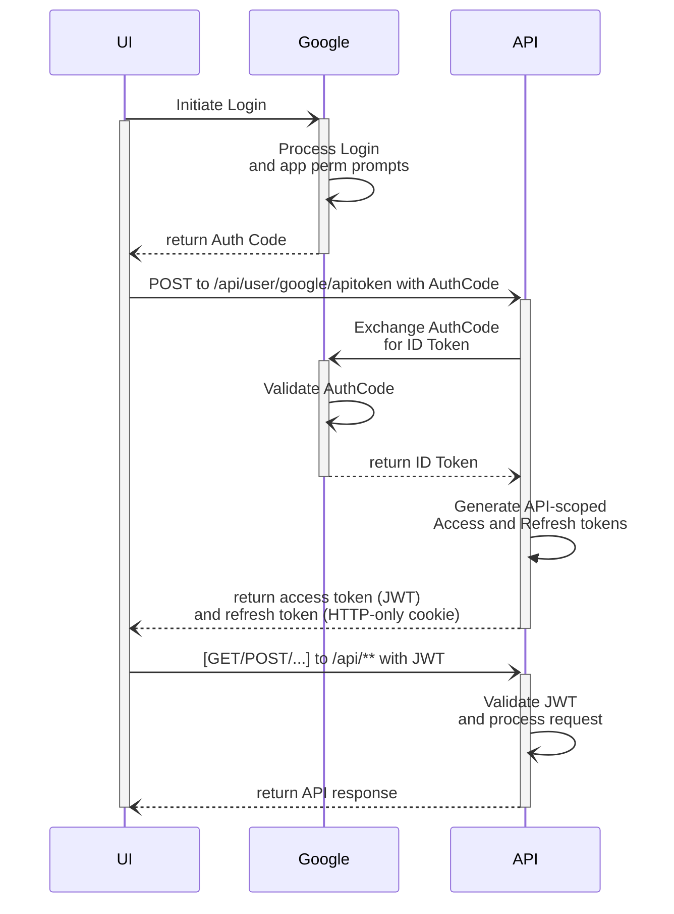

# The License Plate Game

> Find all license plates from each U.S. state and Canadian province.

### Tech stack:
* __Backend__: .net 9, Aspire, ASP Net Core Minimal APIs, EF Core, XUnit, Testcontainers
* __UI__: React Router with Vite, Zustand, Tailwind, Flowbite, Vite PWA, Playwright
* __Infra__: Azure Container Apps, Azure Static Web App, Azure SQL.
* __CI/CD and IaC__: Github Actions, Pulumi

### Architecture
__Design principals__:
1. Single Responsibility Principal (SRP).
1. Command-Query Segragation (CQS).
1. Vertical Slices.
1. Backed-for-frontend (BFF).
1. Domain-Driven Design (DDD) with invariants protection via EF Core backing fields.

### AuthN/AuthZ:
1. Google OAuth to prove the user identity.
1. API-generated access token (JWT) with Refresh Token (http-only cookie).
1. Endpoints by default require valid JWT unless explicitely as as anonymous.

Auth flow:

