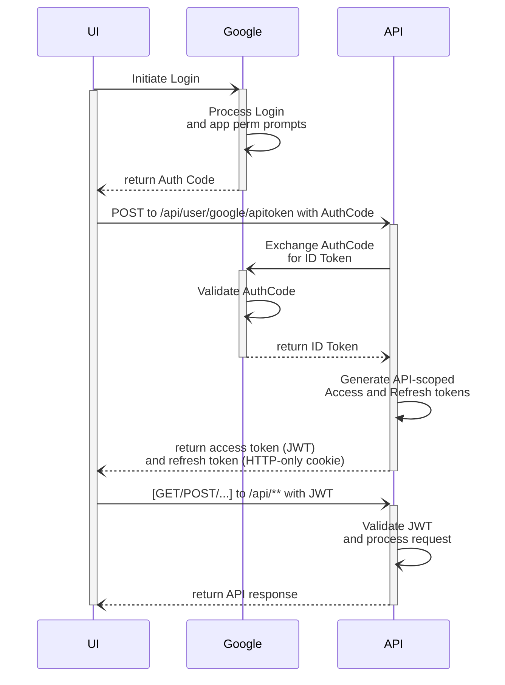

# The License Plate Game

> Find all license plates for U.S. state and Canadian province.

### Tech stack:
* __Backend__: .net 9, Aspire, ASP Net Core Minimal APIs, EF Core, XUnit, Testcontainers
* __UI__: React Router with Vite, Zustand, Tailwind, Flowbite, Vite PWA, Playwright
* __AI__: scikit-learn, onnxruntime-web
* __Infra__: Azure Container Apps, Azure Static Web App, Azure SQL.
* __CI/CD and IaC__: Github Actions, Pulumi

### Architecture
The guiding goal and philosophy of the architectural design decisions in this project are to ensure the long-term maintainability through high code cohesion and low coupling.
__Design principals__:
1. Single Responsibility Principal (SRP).
1. Command-Query Segragation (CQS).
1. Vertical Slices.
1. Backed-for-frontend (BFF).
1. Domain-Driven Design (DDD) with invariants protection via EF Core backing fields.

### AuthN/AuthZ:
The backend leverages Google as the identity provider for authentication, offloading password security concerns and MFA complexities.
1. Google OAuth (auth code) to prove the user identity.
1. API-generated access token (JWT) with Refresh Token (http-only cookie) to access API endpoints.
1. Endpoints by default require valid JWT unless explicitely set as anonymous.

Auth flow:


### AI/ML training and tuning
The UI offers AI-powered license plate search with offline-first support, using visual text descriptions as input to a text-based classifier and ranker. This project uses `scikit-learn` to train a `Logistic Regression` model with the `lbfgs` solver. The `ai/trainer.py` script trains the model and outputs evaluation metrics to guide fine-tuning of the algorithm and its hyperparameters.

#### How to interpret model metrics:
1. __CV Accuracy__. AKA Top-1 Accuracy. Measures how often the model makes the correct prediction during training checks. Higher accuracy means the model is learning useful patterns from the data.
1. __CV Log Loss__. Captures how far the model's predicted probabilities are from the correct answers.
Lower values mean the model is not just guessing correctly but also confident in the right way.
1. __CV ROC AUC Train__. Indicates how well the model separates correct vs incorrect answers during training. Very useful for assessing ranking quality rather than exact top-1 accuracy.
Higher values mean the algorithm is very good at ranking the right choice above the wrong one.
1. __CV ROC AUC Test__. Same as above, but measured on data the model hasn't directly learned from.
Helps confirm whether the model's skill carries over to new data.
1. __CV ROC AUC Train/Test delta__. Difference between training and test performance. A small gap means stable learning; a large gap often means overfitting (too tailored to the training set).
1. __CV NDCG Train__. Measures how well model can produce correct ranking and near the top of predictions during training.
1. __CV NDCG Test__. Same as above, but measured on data the model hasn't directly learned from.
1. __CV NDCG Train/Test delta__. Difference between training and test ranking performance. A small gap means stable learning; a large gap often means overfitting (too tailored to the training set).
1. __Holdout NDCG__. Measures how well model can produce correct ranking and near the top of predictions on a completely separate dataset reserved for final checks.
1. __Holdout Accuracy__. Measures how often the model is right on a completely separate dataset reserved for final checks.
This is the most realistic indicator of future performance.
1. __Holdout Log Loss__. Evaluates how well the model's probability estimates line up with the actual outcomes on final data.
Lower values mean predictions are both accurate and trustworthy.
1. __Holdout vs CV Accuracy delta__.
Compares accuracy during training checks with final accuracy.
A large difference suggests the training process didn't fully reflect real-world performance.
Using CV is safer metric for fine-tuning because it helps avoid false confidence from a lucky or unlucky holdout split.
#### Few notes on model accuracy for this project.
The model is used for ranking the top-10 most relevant license plates based on a user's text description. The primary goal is not to assign high probability or confidence to each plate but rather to produce a useful order of candidates so the correct plate appears early in the list. Many license plates share similar attributes (for example, "white plate" or "blue top"). This overlap has several effects:
1. Traditional accuracy is strict. if the model predicts "CA" for "white plate" when the expected answer is "TX", it counts this prediction as wrong, even though both plates share key features. This lowers accuracy artificially, because from a ranking perspective the model did understand the query traits but could not distinguish between plates with nearly identical descriptions.
1. Overlap = class ambiguity. If multiple labels are nearly indistinguishable by the features provided, the model has no way to reach perfect accuracy. If multiple states all have "white with blue text," the model can only rely on subtler cues (extra words, frequency patterns) to separate them.

### Dev Notes
#### Aspire setup
1. Copy `backend/TheGame.AppHost/appsettings.json` to `backend/TheGame.AppHost/appsettings.Development.json`. This new file should be already git-ignored.
1. Set desired values for the Dev environment in `Parameters` node/object in the JSON settings file.
#### Integration tests setup
1. Copy `backend/TheGame.Tests/testsettings.sample.json` to `backend/TheGame.Tests/testsettings.json`. This new file should be already git-ignored.
1. Set desired values for the Dev environment.
#### EF Migrations
`dotnet ef migrations add <Migration-Name> --project .\TheGame.Domain --startup-project .\TheGame.Api`
Migrations will be applied automatically in dev. See `TheGame.Api.Program`.
#### Plate Search Model training
Do it once to set up python virtual environment:
```
cd ai
py -m venv .venv
.\.venv\Scripts\Activate.ps1
pip install -r requirements.txt
```
For training model with pre-computed params:
```
cd ai
py trainer.py
```
For training model with grid_search
```
cd ai
py trainer.py --use-search
```