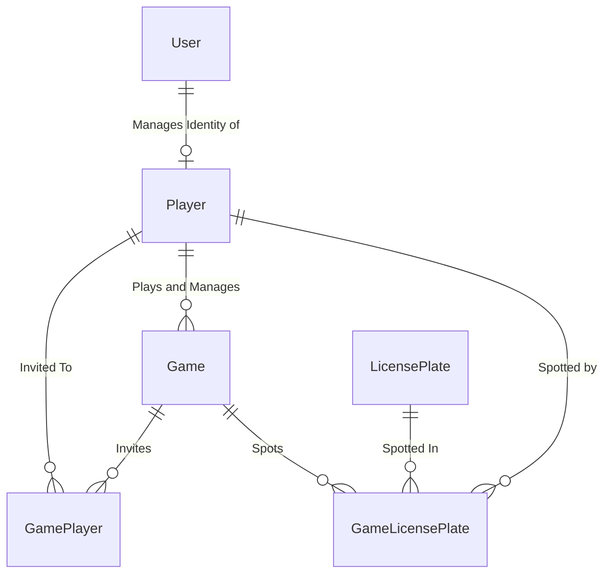

## How to use API
1. Install WSL2 and Docker.
1. Set `docker-compose` as a startup project.
1. Create `.env` file in `docker-compose`. See `.env.sample` for a template. Populate necessary env vars.
1. Generate ssl
1. Run. Once all images have been pulled, VS should open [NGINX dev page](https://localhost:8080/dev_page/) automatically. It will contain links to UI and API projects

## Dev SSL Certs
Generate dev certs using `dotnet dev-certs https` commands:
```powershell
# cd to ./backend folder
# if cert is already present
dotnet dev-certs https --clean
dotnet dev-certs https --export-path "./nginx/ssl/thegame.pfx" --password <SSL_CERT_PASSWORD>
dotnet dev-certs https --trust
```
Convert pfx to crt and rsa. See [PFX to CRT](https://medium.com/knoldus/nginx-easiest-way-to-setup-ssl-using-pfx-files-f9e1a03eff74).

Alternatively, use [Let's Encrypt Certbot](https://letsencrypt.org/getting-started/).

## EF Migrations
This project uses code-first EF migrations.

> Make sure to set `GameDB` connection string in `appsettings.Development.json` first before running migrations!

#### Add new migration
`dotnet ef migrations add <migration_name> --verbose --startup-project "TheGame.Api" --project "TheGame.Domain" --output-dir "DomainModels/Migrations"`

### Run migration
`dotnet ef database update --startup-project "TheGame.Api" --project "TheGame.Api"`


## Game ERD


# The Game IaC
This project uses Pulumi Automation API.

### Game Infra setup
Deployment is managed by github actions and Pulumi. Pulumi will handle CRUD of the Azure resources and manage Azure SQL User role assignments for Container App Managed Identity.
#### Prerequisites
Some of these steps can be automated but for the current setup it is assumed these are done manually:
1. Add Microsoft.App provider to subscription.
1. Create a new Resource Group (eg. `rg-thegame-<env>`) in the subscription.
1. Create Azure Blob Storage and Container for managing Pulumi backend state. Use RBAC only auth.
1. Create a new Service Principal (SP) in Entra (App Registration) to be used by Pulumi. Create and note app secret.
1. Assign `Owner` role to new SP on the resource group. More granular RBAC roles should be explored for Production.
1. Assign `Storage Blob Data Contributor` to blob storage.
1. Create Azure SQL server and database. Use free serverless tier for dev. Select Entra auth only mode (passwordless). Follow [Passwordless Setup Instructions](https://learn.microsoft.com/en-us/azure/azure-sql/database/azure-sql-dotnet-quickstart?view=azuresql&tabs=visual-studio%2Cpasswordless%2Cservice-connector%2Cportal). This step will be automated once other areas of IaC and Deployment pipelines are taken care of.
1. Deploy script will need `az login` to establish an identity required to spin up Azure Infra and run db migrations (for simplicity sake, pulumi sp will have owner role over res group AND sql admin). [Setup for GH actions](https://www.gatevnotes.com/passwordless-authentication-github-actions-to-microsoft-azure/).

#### Database Migrations
During dev, a simple `dotnet ef migration update --project .\TheGame.Domain\ --startup-project .\TheGame.DbMigrator\` should be sufficient (assuming `appsettings.Development.json` has a valid sql connection string).
In CI/CD context, migrations will be handled by ef bundle. This setup allows running migrations without needing to connect to database directly to generate sql. This also means db should not be managed with manual scripts:
1. Create bundle: `dotnet ef migrations bundle --self-contained -r linux-x64 --project .\TheGame.Domain\ --startup-project .\TheGame.DbMigrator\ --force`
1. Run bundle: `./efbundle --connection <conn_string>`

#### ACA Gotchas
1. Init Containers do not currently support Managed Identity for consumption environments. This breaks passwordless SQL authentication during migrations. See [MSDN](https://learn.microsoft.com/en-us/azure/container-apps/managed-identity?tabs=portal%2Cdotnet#control-managed-identity-availability) and [GH Issue](https://github.com/microsoft/azure-container-apps/issues/807)
1. Init Containers will run every time main container scales from 0 to 1+. When at zero, K8s deletes pod, and when scaled above 0 it re-creates one, triggering init container to run again. With scale to 0 requirement, init container is not a good solution to run migrations.