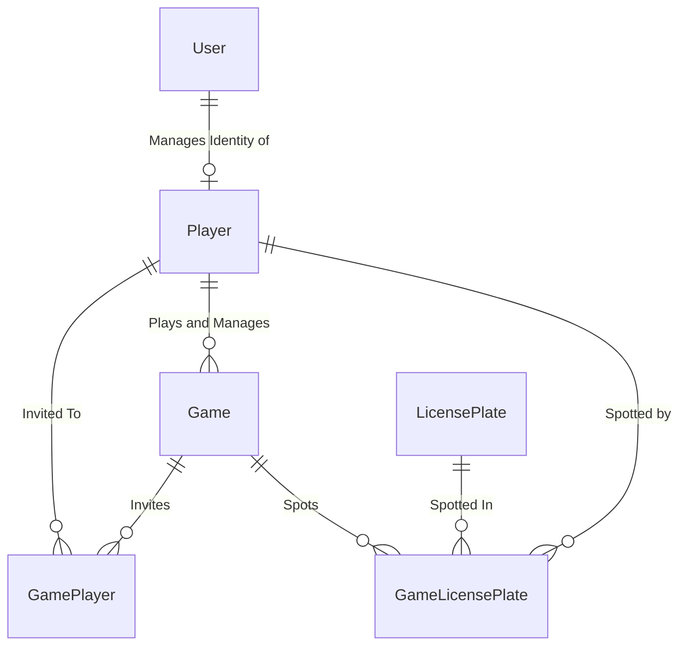

## How to use API
1. Install WSL2 and Docker.
1. Set `docker-compose` as a startup project.
1. Create `.env` file in `docker-compose`. See `.env.sample` for a template. Populate necessary env vars.
1. Run. Once all images have been pulled, VS should open [Game API Swagger UI](https://localhost:8080/swagger/index.html) automatically.
1. Check API health by visiting [API Healthcheck endpoint](https://localhost:8080/health)

## EF Migrations
This project uses code-first EF migrations.

> Make sure to set `GameDB` connection string in `appsettings.Development.json` first before running migrations!

#### Add new migration
`dotnet ef migrations add <migration_name> --verbose --startup-project "TheGame.Api" --project "TheGame.Domain" --output-dir "DomainModels/Migrations"`

### Run migration
`dotnet ef database update --startup-project "TheGame.Api" --project "TheGame.Api"`

## Game ERD
