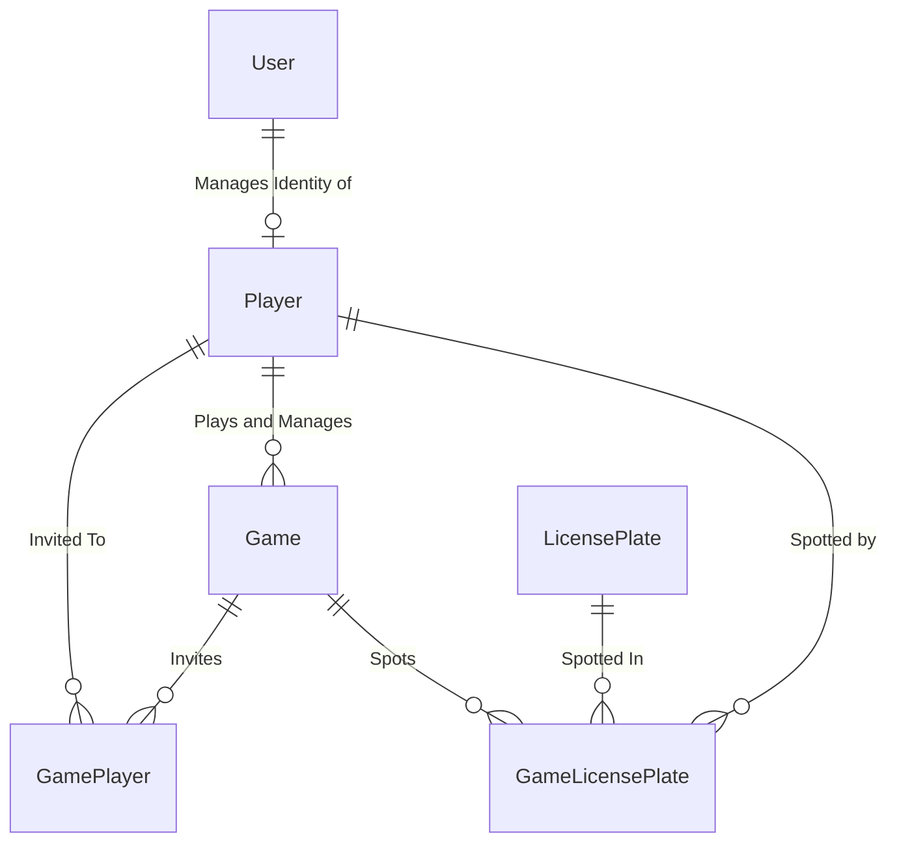

## How to use API
1. Install WSL2 and Docker.
1. Set `docker-compose` as a startup project.
1. Create `.env` file in `docker-compose`. See `.env.sample` for a template. Populate necessary env vars.
1. Generate ssl
1. Run. Once all images have been pulled, VS should open [NGINX dev page](https://localhost:8080/dev_page/) automatically. It will contain links to UI and API projects

## Dev SSL Certs
Generate dev certs using `dotnet dev-certs https` commands:
```powershell
# cd to ./backend folder
# if cert is already present
dotnet dev-certs https --clean
dotnet dev-certs https --export-path "./nginx/ssl/thegame.pfx" --password <SSL_CERT_PASSWORD>
dotnet dev-certs https --trust
```
Convert pfx to crt and rsa. See [PFX to CRT](https://medium.com/knoldus/nginx-easiest-way-to-setup-ssl-using-pfx-files-f9e1a03eff74).

Alternatively, use [Let's Encrypt Certbot](https://letsencrypt.org/getting-started/).

## EF Migrations
This project uses code-first EF migrations.

> Make sure to set `GameDB` connection string in `appsettings.Development.json` first before running migrations!

#### Add new migration
`dotnet ef migrations add <migration_name> --verbose --startup-project "TheGame.Api" --project "TheGame.Domain" --output-dir "DomainModels/Migrations"`

### Run migration
`dotnet ef database update --startup-project "TheGame.Api" --project "TheGame.Api"`


## Game ERD
